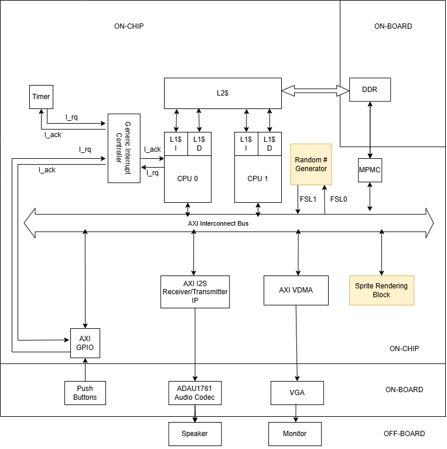

<h4 align="center">
  
</h4>

<h1 align="center">
    Flappy Bird: Zynq-7000 SoC Implementation
</h1>

<p align="center">
    <strong>A real-time, hardware-accelerated game engine featuring HW/SW partitioning.</strong>
</p>

<p align="center">
    <a href="#description">Description</a> •
    <a href="#hw-sw-architecture">Architecture</a> •
    <a href="#technical-specifications">Specifications</a> •
    <a href="#project-structure">Structure</a> •
    <a href="#getting-started">Setup</a> •
    <a href="#controls">Controls</a>
</p>

---

## Description

This project is a high-performance, **hardware-accelerated** implementation of Flappy Bird designed for the **Xilinx Zynq-7000 SoC**. By leveraging the dual-nature of the Zynq architecture, the system offloads computationally expensive pixel-rendering to the **Programmable Logic (PL)**, while the **Processing System (PS)** handles the high-level game state and physics. 

The result is a silky-smooth **60 FPS** experience with zero CPU overhead for display driving.

## HW-SW Architecture

The system follows a classic SoC partitioning strategy, using the **AXI4-Lite** protocol to bridge the ARM Cortex-A9 cores with the custom FPGA fabric.

<h4 align="center">
  
</h4>

### Logic Partitioning

| Component | Responsibility | Implementation |
| :--- | :--- | :--- |
| **Processing System (PS)** | Game state machine, collision detection, and gravity physics. | C / ARM Cortex-A9 |
| **Programmable Logic (PL)** | VGA timing generation, sprite ROM management, and frame rendering. | Verilog / VHDL |
| **Interconnect** | Memory-mapped I/O for bird/pipe coordinates. | AXI4-Lite |

> **Note:** The PS only updates entity coordinates once per frame. The PL interprets these coordinates to render the scene deterministically, ensuring jitter-free video.

---

## Technical Specifications

### Physics & Dynamics
The bird's trajectory is calculated in the PS using **Euler Integration**. This allows for easy adjustments to "gravity" and "jump strength" constants in the software layer.

$$y_{t+1} = y_t + v_t \Delta t$$
$$v_{t+1} = v_t + g \Delta t$$

### Video Pipeline
The VGA controller is a custom RTL module designed to meet industry-standard timing for **640x480 @ 60Hz**.

* **Pixel Clock:** $25.175\text{ MHz}$
* **Color Depth:** 12-bit (4-bit per RGB channel)
* **Rendering:** Hardware sprite-stacking with transparency support.

---

## Project Structure

```text
Zynq-SoC-Flappy-Bird/
├── hardware/                # Vivado Project & Block Designs
├── src/
│   ├── core_0.c             # Main Game Loop (Bare-metal)
│   ├── GameManager/         # Collision logic & Score tracking
│   ├── Entity/              # Object classes (Bird, Pipes, Background)
│   ├── Sprites/             # Sprite bitmaps & Rendering drivers
│   └── font8x8.c            # Hardware-accelerated font renderer
├── img/                     # Documentation assets
└── lscript.ld               # ARM Linker script
